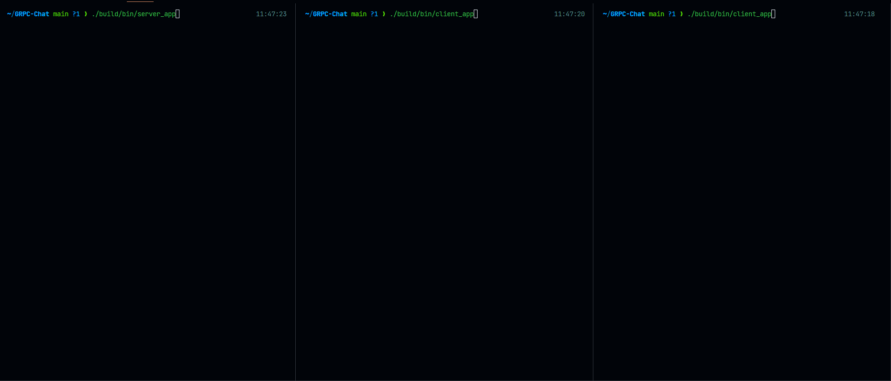

# GRPC-RPP-Chat

Example implementation of RPC chat with server/client, authenication and etc using GRPC for RPC communication and RPP for internal streaming logic (via RPPGRPC)

## Example:



## Implementation:

Both (server and client) uses grpc streaming inside. But instead of raw using grpc streams they are wrap them into RPP observables/observers so it can be easily piped to make any complex streams of data.

For example, chat's stream wrapped to rpp via rppgrpc's reactor:
https://github.com/victimsnino/GRPC-RPP-Chat/blob/main/src/client/chat_client/chat_client.cpp#L62

## Building with conan:

```cmd
conan install . --output-folder=build --build=missing -s compiler.cppstd=20 -c tools.system.package_manager:mode=install -c tools.system.package_manager:sudo=True -s=build_type=Release
cmake -B build -DCMAKE_TOOLCHAIN_FILE=build/conan_toolchain.cmake -DCMAKE_BUILD_TYPE=Release
cmake --build build -j32        
```
